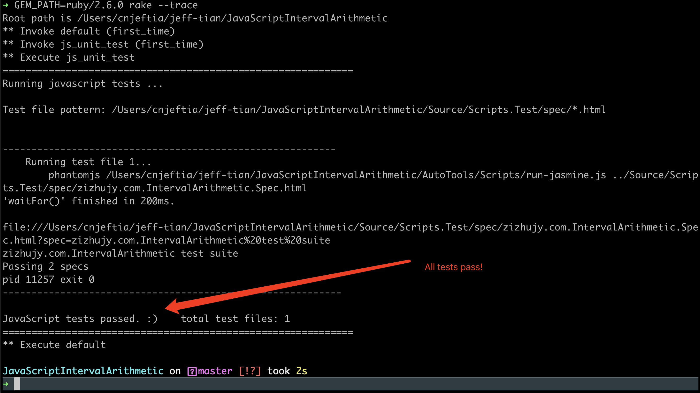
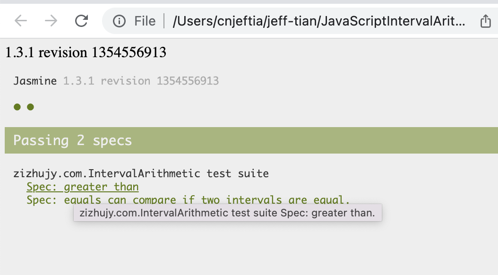
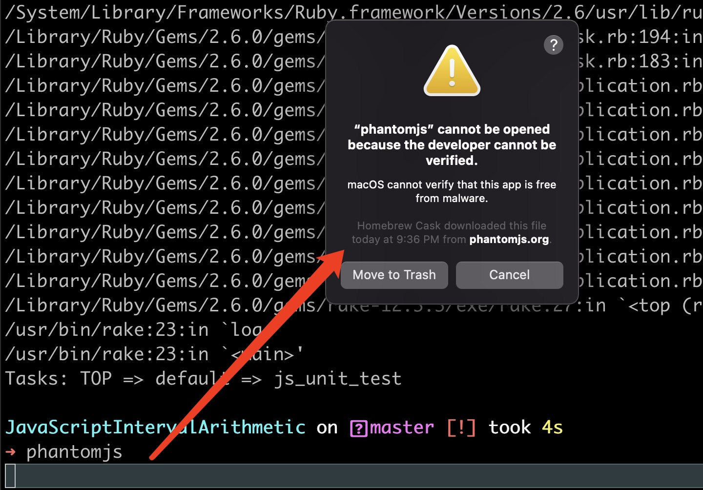
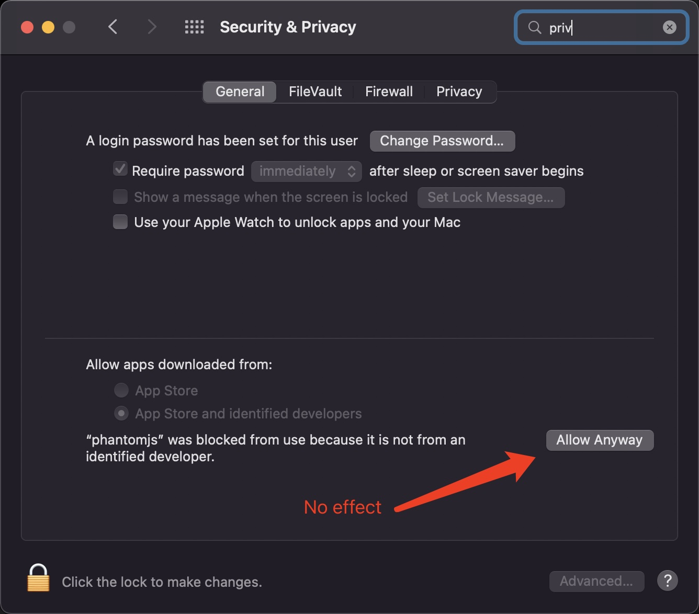
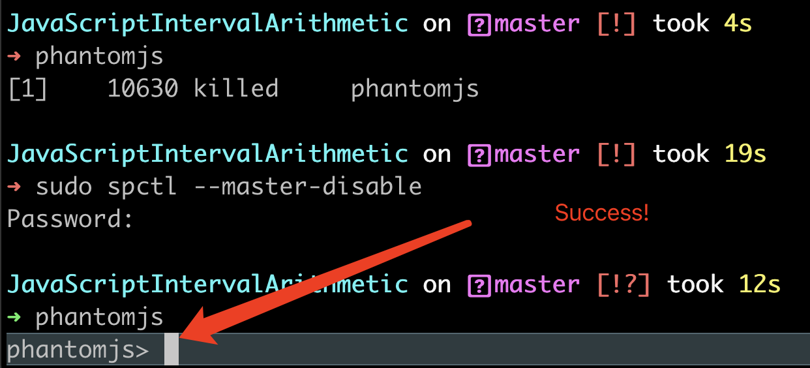

JavaScriptIntervalArithmetic
============================

JavaScript Implementation of Interval Arithmetic.

This is a javascript library for Interval Arithmetic. Interval Arithmetic can avoid the arcuracy loss during floating point calculation. 
You can find out more about Interval Arithmetic and its uses [on wikipedia](http://en.wikipedia.org/wiki/Interval_arithmetic).

Now this library is being used for implicit function plotting by https://zizhujy.js.org/zh-CN/FunctionGrapher.html.

Install ruby
=============
```
scoop install ruby
```

Install msys2 suggested by ruby
=============
```
scoop install msys2
```

Install rake
==============
```
gem install rake
```

Install dependencies
================
```
bundle install
```

Install phantomjs
=================
The js test cases can be executed by phantomjs, to install it, run:

```shell
brew install --cask phantomjs
```

Running tests
==================
With the above toolchain installed, you can just type `rake` to run tests.

In mac osx:

```shell
GEM_PATH=ruby/2.6.0 rake --trace
```



### Check test details 

open the html report file indicated by the command line output in the above step:

```shell
open file:///Users/cnjeftia/jeff-tian/JavaScriptIntervalArithmetic/Source/Scripts.Test/spec/zizhujy.com.IntervalArithmetic.Spec.html?spec=zizhujy.com.IntervalArithmetic%20test%20suite
```



Trouble shooting guide
===============

1. mac os `bundle install` errors: 
```shell
/System/Library/Frameworks/Ruby.framework/Versions/2.6/usr/lib/ruby/2.6.0/rubygems.rb:283:in `find_spec_for_exe': Could not find 'bundler' (2.3.7) required by your /Users/cnjeftia/jeff-tian/JavaScriptIntervalArithmetic/Gemfile.lock. (Gem::GemNotFoundException)
To update to the latest version installed on your system, run `bundle update --bundler`.
To install the missing version, run `gem install bundler:2.3.7`
	from /System/Library/Frameworks/Ruby.framework/Versions/2.6/usr/lib/ruby/2.6.0/rubygems.rb:302:in `activate_bin_path'
	from /usr/bin/bundle:23:in `<main>'
```

You can fix it follow the error messages, or just type 

```shell
sudo gem install bundler
```

to install latest bundler


2. mac os `phantomjs` can not be opened



Refer to https://www.yuque.com/tian-jie/blog/xsh9nz, run 

```shell
sudo spctl --master-disable
```

